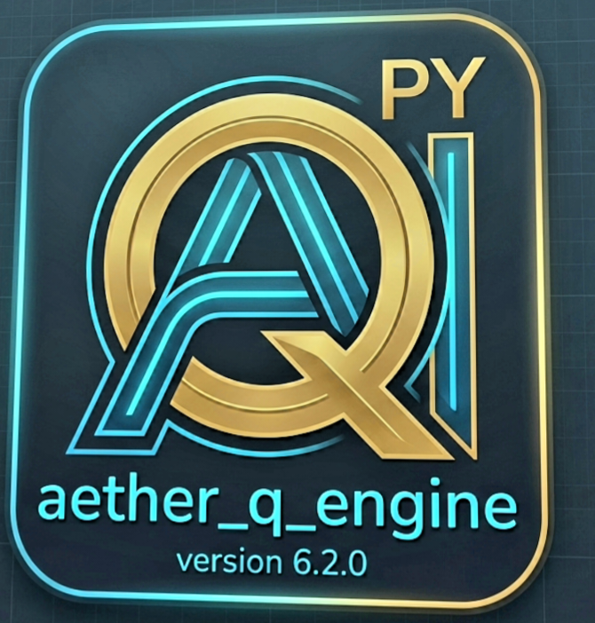

# Aether_q_engine-

​1. INTRODUCTION AND OVERVIEW

​Modern software development increasingly demands intelligent, adaptive decision-making agents capable of learning directly from runtime feedback, background automation tasks, or interactive systems. While traditional machine learning libraries often introduce heavy dependencies, complex configuration files, or massive computational requirements, lightweight reinforcement learning packages provide an alternative. The AETHER_Q library (published on PyPI as AETHER_Q_ENGINE) is engineered specifically for high-frequency runtime loops, multi-agent systems, and real-time execution environments.
​This guide serves as a complete reference manual for software developers, students, and engineers looking to integrate AETHER_Q into any custom Python project. Whether you are building a text-based utility automation script, a mobile background process, a data pipeline controller, or an interactive application, this tutorial covers the installation procedures, foundational API structures, core integration steps, and best practices for achieving rapid algorithmic convergence.

​2. PACKAGE INSTALLATION AND SETUP

​Before writing integration code, the package must be installed within your active Python environment. The library is fully compatible with standard desktop Python installations as well as mobile Python runtimes.

​INSTALLATION VIA PIP

​Open your terminal, command prompt, or shell environment and execute the standard installation command to fetch the latest stable release from PyPI:
​pip install aether_q
​If you already have an older version installed and wish to update to the latest build, include the upgrade flag:
​pip install --upgrade aether_q

​VERIFYING THE INSTALLATION

​To ensure the package has been correctly integrated into your Python path, open a Python shell or create a brief test script to import the module and instantiate the core controller class:
​import aether_q
​test_brain = aether_q.DynamicAIBrain(lr=0.35, gamma=0.90, epsilon=0.20, role="VERIFICATION_NODE")
​print("Successfully loaded aether_q! Assigned Role: " + test_brain.role)

​3. CORE ARCHITECTURE AND API REFERENCE

​To successfully adapt the engine to your project, you must understand how data flows through the primary controller object: DYNAMIC_AI_BRAIN. The engine uses a Quantum-State Node Tree alongside pheromone decay and temporal-difference error calculations to determine optimal choices.
​BRAIN INITIALIZATION PARAMETERS
​When creating a brain instance, you can configure several hyperparameters that govern how the agent learns and explores:
​LEARNING RATE (LR): Typically ranges from 0.05 to 0.50. Determines how heavily new experiences override older knowledge.
​DISCOUNT FACTOR (GAMMA): Ranges from 0.70 to 0.99. Dictates how much the agent values future rewards versus immediate feedback.
​EXPLORATION RATE (EPSILON): Controls the probability that the agent will choose a random action to explore new behaviors instead of exploiting known optimal choices.
​ROLE (STRING IDENTIFIER): A descriptive tag used for logging, multi-agent categorization, or worker differentiation.
​ACTION SELECTION VIA DECIDE_ACTION
​During every update cycle or execution tick of your software, you query the AI to decide what action should be taken next. The method accepts various system inputs and scalar metrics:
​chosen_action_index = brain.decide_action(val_primary=100.0, val_secondary=0.0, spatial_dx=0.0, spatial_dy=0.0, flag_alpha=False, flag_beta=True, segment_bucket=0)
​This method returns an integer representing the selected action index (typically 0, 1, 2, or 3), which you then map to your project's native feature set.
​REINFORCEMENT LEARNING VIA LEARN
​Once your application executes the chosen action and computes the resulting environment or state change, you must feed feedback back into the engine so it can update its internal weights:
​td_error = brain.learn(next_dx=0.0, next_dist=0.0, flag_alpha=False, flag_beta=True, reward=10.0, segment_bucket=0)
​This method returns the absolute Temporal-Difference Error, which quantifies how surprising or unexpected the reward feedback was.

​4. UNIVERSAL STEP-BY-STEP INTEGRATION FRAMEWORK

​Because AETHER_Q is completely decoupled from any specific user interface or business domain framework, you can drop it into any project architecture by following a consistent four-phase pattern:

​STEP 1: MAP PROJECT ACTIONS TO INTEGER INDICES

​Define what each integer output from decide_action means inside your application domain. For instance:
​ACTION 0: Execute primary routine, purchase asset, or move forward.
​ACTION 1: Shift parameter down, decrease variable, or execute secondary routine.
​ACTION 2: Shift parameter up, increase variable, or hold state.
​ACTION 3: Reverse action, close background process, or switch execution mode.

​STEP 2: ESTABLISH A CLEAR REWARD FUNCTION

​The success of your integrated AI depends entirely on how well you structure your reward function. Assign scalar values based on performance milestones:
​MAJOR SUCCESS / OBJECTIVE REACHED: +100.0 to +500.0
​INCREMENTAL PROGRESS: +5.0 to +15.0
​INEFFICIENT ACTION / MINOR PENALTY: -2.0 to -10.0
​CRITICAL FAILURE / ERROR STATE: -20.0 to -50.0

​STEP 3: IMPLEMENT THE INTEGRATION BOILERPLATE

​Below is a universal class template that can be integrated into any custom Python script, automation routine, or background worker loop:
​import aether_q
​class UniversalProjectAgent:
​def init(self):
​self.brain = aether_q.DynamicAIBrain(lr=0.30, gamma=0.92, epsilon=0.15, role="UNIVERSAL_CONTROLLER")
​def process_application_cycle(self, raw_system_data):
​primary_val = raw_system_data.get("health", 100.0)
​secondary_val = raw_system_data.get("distance", 10.0)
​dx = raw_system_data.get("dx", 0.0)
​dy = raw_system_data.get("dy", 0.0)
​action_index = self.brain.decide_action(primary_val, secondary_val, dx, dy, False, True, 0)
​reward = 50.0 if action_index == 0 else -2.0
​self.brain.learn(0.0, 5.0, False, True, reward, 0)
​return action_index, reward

​5. ADVANCED STRATEGIES: MULTI-AGENT SWARM TOPOLOGY

​For projects requiring multiple parallel workers, specialized background branches, or distributed tasks, AETHER_Q supports advanced tree cloning and topology synchronization.
​When running multiple instances, you can designate a master brain to collect high-performing pathways while individual worker brains explore distinct operational strategies:
​master_controller = aether_q.DynamicAIBrain(role="MASTER_CORE")
​workers = [aether_q.DynamicAIBrain(role="WORKER_NODE_" + str(i)) for i in range(5)]
​for worker in workers:
​for key, tree_node in master_controller.trees.items():
​worker.trees[key] = tree_node.clone()

​6. CONCLUSION AND BEST PRACTICES

​Integrating the AETHER_Q engine transforms static scripts into autonomous, self-optimizing systems. To guarantee maximum performance across your projects, adhere to these operational guidelines:
​MAINTAIN HIGH-SPEED LOOPS: Keep your system metric calculations lightweight to ensure the AI loop runs smoothly without processing latency.
​NORMALIZE INPUT VALUES: Ensure numerical deltas and scalar metrics remain within manageable bounds to facilitate stable Q-value convergence.
​TUNE HYPERPARAMETERS GRADUALLY: Adjust learning rates and exploration caps incrementally based on how rapidly your specific execution environment changes.
